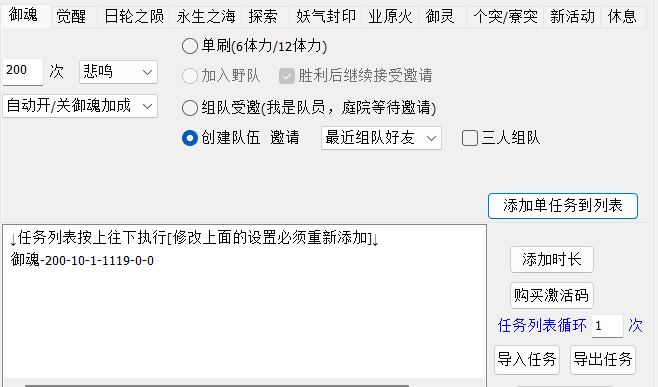
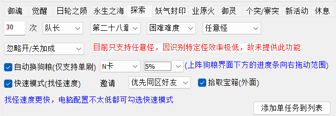
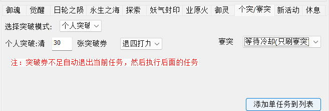
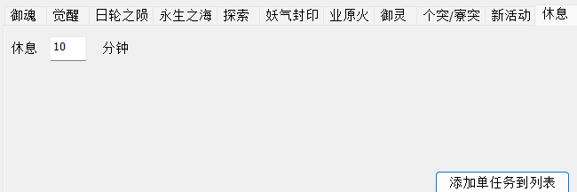
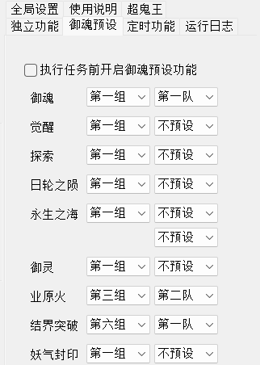
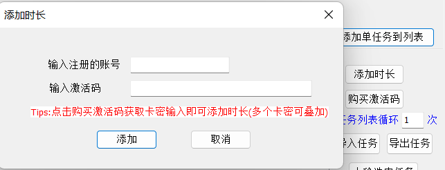

# YYS_ASSIST 使用文档
## 前言
<b>一款基于C++结合MFC开发的阴阳师图色识别助手，模拟人手点击操作，使用大量的随机延迟函数和随机延迟点击，稳定防封。</b>
## 准备工作
>1.首先，下载雷电4/5或者mumu模拟器，在模拟器设置中将分辨率设为960*540 160dpi，若使用mumu模拟器，请在桌面右键mumu模拟器图标->点击属性->点击兼容性->勾选以兼容模式运行->下拉框选择win7->点击应用。 注：若电脑是win7系统，需将主题改为Windows经典：桌面右键->个性化->双击Windows经典

>2.下载阴阳师apk:雷电推荐此优化版本 【[点我下载](https://g37.gdl.netease.com/onmyoji_cps_mumu_1.7.46.apk)】，mumu可在模拟器商店自行下载。下载完启动阴阳师，进入游戏界面。 注：游戏内庭院皮肤需使用默认皮或者帝释天皮；若式神委派没领，会有一只红色蝴蝶导致识别不到探索灯笼

>3.助手下载链接：[蓝奏云][点我下载](https://ricarda.lanzouq.com/b01vbp6te)，密码1234打开助手后点击注册获取试用时长。然后点击登录，输入刚注册的账密即可。

>4.拖动助手内绿色句柄图标对准模拟器内部的游戏窗口，待右侧文本框出现模拟器名称即可。

>5.到此，准备工作已完成。
## 使用手册
### 御魂、觉醒等普通副本
>游戏保持在庭院界面，在脚本御魂功能处输入好次数、选择好层数、是否开加成、身份(单刷|组队受邀|创建队伍)、邀请方式(最近组队好友  固定好友])，然后点击添加单任务到列表，点击开始启动即可！【觉醒、日轮之陨、永生之海、妖气封印、业原火、御灵】设置与御魂相同，可参考御魂设置。 

</img> 
>注：若是三人组队，请勾选三人组队并配合其左侧的固定队友使用。若修改配置，需重新添加到任务列表，并重新启动任务。
### 探索
>探索功能的使用基本与御魂设置相同，可参照御魂设置。 注意点： &nbsp;&nbsp;&nbsp;&nbsp;1.自动狗粮后面的百分比默认是5%，意思是在换狗粮界面时，先将下方进度条向右拖动5%，然后再开始识别狗粮，目的是排除前面的一些有等级的狗粮的影响。一般保持默认就行。 &nbsp;&nbsp;&nbsp;&nbsp;2.在双开的情况下，若两个号是组队刷探索，且开启了拾取宝箱功能，则需在全局设置里勾选游戏一与游戏二为组队关系，单刷则不用。 

</img>
### 突破
>突破分为个人突破和寮突，若选择个人突破，则右侧寮突不生效，反之亦然。 个人突破：分为正常突破与退四打九(解释：卡57级，勋章多、且好打)，根据个人需求选择即可。 
寮突：若选择等待冷却：6次用完则会原地等待；若选择不等待冷却，次数用尽会退出寮突，继续任务列表的下一个任务。 

</img>
### 休息
>休息功能可以配合定时功能使用，如开启了自动寄养，则会在休息开始前执行(任务列表有多条休息任务时，每次休息前都会检测寄养)，可以通过合理分配休息时间灵活控制寄养。 

</img> 
>举例：定时功能开启了自动寄养，在任务列表添加10条休息60分钟的任务，那么将会先检测一次寄养，然后开始休息，60分钟后会再检测一次寄养，继续第二次休息......，直到10次休息完毕为止。
### 御魂预设
>开启御魂预设功能后，将会在每次任务开始前进式神录切换队伍的御魂。 
组代表右边的分组；队代表左边的队伍。 

</img> 
>注意：式神录皮肤需设为默认
### 独立功能
待完善......
### 定时功能
待完善......
### 全局设置
待完善......
### 双开
待完善......
### 激活码购买与添加时长
>点击购买激活码会自动跳转到购买界面，购买后，点击添加时长会弹出如下界面，输入注册的账号与刚购买的激活码即可添加。 

</img> 
>也可在此购买：购买链接-[[点我](http://www.sakurayys.com/#shop)] 
## API文档
待完善......
## 常见问题
待完善......
## 交流群
<b>QQ交流群：753472503</b>
